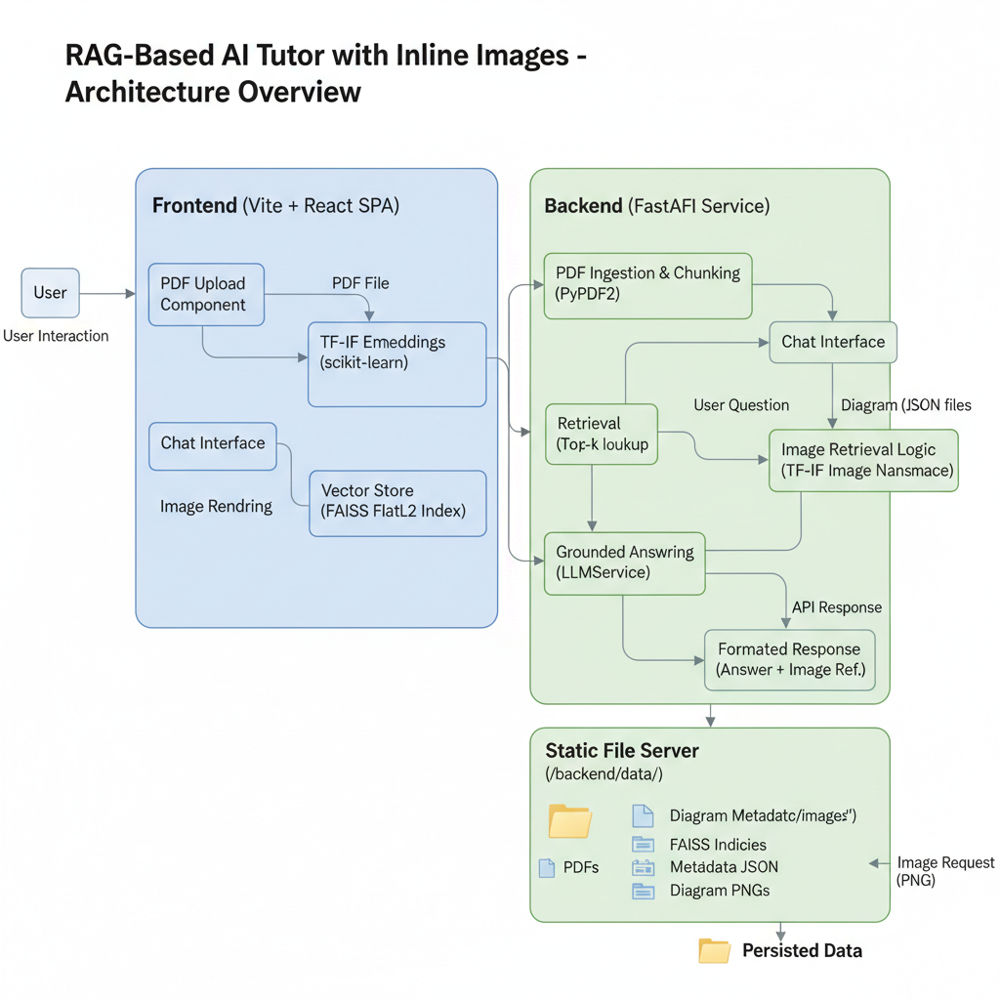

# 🧠 RAG-Powered AI Tutor with Intelligent Diagram Retrieval

A sophisticated, fully local AI tutoring system that combines Retrieval-Augmented Generation (RAG) with intelligent image retrieval to provide contextual learning experiences with relevant visual aids.

## 🎯 Project Objective

This project addresses the challenge of creating an intelligent tutoring system that can:
- Process educational materials (PDFs) and answer questions based **exclusively** on the provided content
- **Automatically identify and display** the most relevant diagrams/images that support the textual answers
- Operate **completely locally** without relying on external API services
- Provide **citations and source verification** to build trust in the responses

## 🏗️ System Architecture

The system is built with a modern decoupled architecture featuring a React frontend and FastAPI backend, designed for efficient document processing and intelligent retrieval.



### Architecture Components

#### Frontend (Vite + React SPA)
- **User Interface**: Clean, responsive chat-based interface
- **PDF Upload Component**: Drag-and-drop file upload with progress tracking
- **Chat Interface**: Real-time Q&A with message history
- **Image Rendering**: Dynamic display of relevant diagrams alongside answers

#### Backend (FastAPI Service)
- **PDF Ingestion & Chunking**: Uses PyPDF2 for text extraction and intelligent chunking
- **TF-IDF Embeddings**: Lightweight semantic embeddings using scikit-learn
- **Vector Store**: FAISS FlatL2 index for high-performance similarity search
- **Image Retrieval Logic**: Separate TF-IDF namespace for diagram matching
- **Grounded Answering**: LLMService for context-aware response generation
- **API Response**: Structured JSON responses with answers and image references

#### Data Persistence Layer
- **Static File Server**: Serves diagram images and static assets from `/backend/data/`
- **FAISS Indices**: Persistent vector stores for fast retrieval
- **Metadata JSON**: Document and chunk metadata storage
- **Diagram PNGs**: Curated visual assets for educational content

### Workflow Process

1. **Document Ingestion**: PDF → Text Extraction → Chunking → TF-IDF Embeddings → FAISS Storage
2. **Query Processing**: User Question → Dual Retrieval (Text + Images) → Response Generation
3. **Response Delivery**: Formatted Answer + Image Reference → Frontend Rendering

## 🚀 Key Features

### ✨ Core Capabilities
- **Smart Document Processing**: Automatically extracts text and identifies diagram contexts from PDFs
- **Dual-Modal Retrieval**: Simultaneously searches for relevant text passages AND supporting images
- **Citation-Based Answers**: Every response includes source references from the original material
- **Fully Local Operation**: No external dependencies or API keys required after setup

### 🎯 Advanced Functionality
- **TF-IDF Powered Embeddings**: Lightweight yet effective semantic search using scikit-learn
- **FAISS Vector Storage**: High-performance similarity search for rapid retrieval
- **Rule-Based Response Generation**: Ensures answers are grounded in source material
- **Static Asset Serving**: Efficient delivery of diagram images via FastAPI static routes

## 📁 Project Structure

```bash
Assignment_Edulevel/
├── backend/
│   ├── app/
│   │   ├── api/
│   │   │   ├── endpoints/          # FastAPI route handlers
│   │   │   │   ├── chat.py        # Q&A endpoint logic
│   │   │   │   └── upload.py      # PDF processing endpoint
│   │   │   └── routers.py         # API route configurations
│   │   ├── core/                  # Application configuration
│   │   │   └── config.py          # Settings and constants
│   │   ├── services/              # Business logic layer
│   │   │   ├── pdf_service.py     # PDF parsing and text extraction
│   │   │   ├── rag_service.py     # RAG pipeline implementation
│   │   │   ├── llm_service.py     # Response generation logic
│   │   │   └── image_service.py   # Diagram matching and retrieval
│   │   └── main.py               # FastAPI application entry point
│   ├── data/                     # Persistent data storage
│   │   ├── pdfs/                 # Uploaded PDF documents
│   │   ├── indices/              # FAISS vector indices
│   │   ├── images/               # Extracted diagram assets
│   │   └── metadata/             # JSON files for document tracking
│   ├── requirements.txt          # Python dependencies
│   └── venv/                     # Python virtual environment
├── frontend/
│   ├── public/                   # Static assets
│   ├── src/
│   │   ├── components/           # React components
│   │   │   ├── ChatInterface.jsx # Main chat component
│   │   │   ├── FileUpload.jsx    # PDF upload handler
│   │   │   └── MessageBubble.jsx # Individual message display
│   │   ├── hooks/                # Custom React hooks
│   │   ├── services/             # API client services
│   │   ├── utils/                # Helper functions
│   │   └── App.jsx               # Main application component
│   ├── package.json              # NPM dependencies and scripts
│   └── vite.config.js           # Vite build configuration
└── README.md                    # Project documentation
