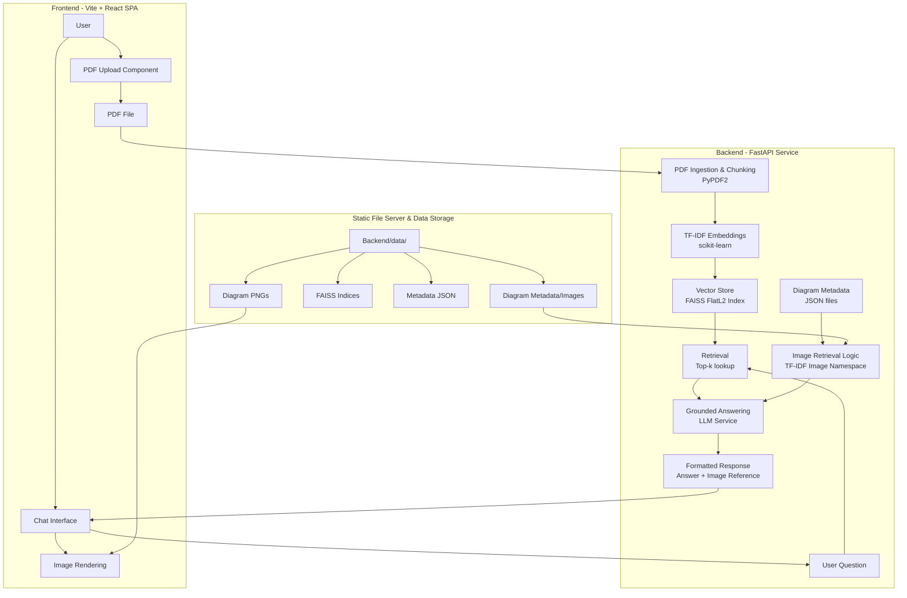

# RAG-Based AI Tutor with Image Retrieval

An intelligent AI tutor chatbot that uses Retrieval Augmented Generation (RAG) to answer questions from uploaded PDF chapters and automatically displays relevant educational diagrams during explanations.

## 🎯 Features

- **PDF Processing**: Upload and extract text from educational PDFs
- **RAG Pipeline**: Retrieve relevant content using TF-IDF embeddings and FAISS vector storage
- **AI-Powered Answers**: Generate contextual responses using GPT-3.5-turbo
- **Smart Image Retrieval**: Automatically find and display relevant diagrams based on content similarity
- **Interactive Chat Interface**: Clean, responsive UI for seamless learning experience

## 🏗️ System Architecture

### High-Level Architecture Overview



## 🔄 Data Flow Process

### 1. **PDF Processing Pipeline**
```
User Upload → PDF Extraction → Text Chunking → TF-IDF Embeddings → FAISS Storage
```

### 2. **Query Processing Pipeline**
```
User Question → TF-IDF Embedding → FAISS Retrieval → Context + Image Matching → LLM Generation → Response
```

### 3. **Image Retrieval Pipeline**
```
Query → Image Embedding Similarity → Top Match Selection → Image Metadata Return → Frontend Display
```

## 📊 Component Details

### **Frontend Layer (Vite + React SPA)**
- **PDF Upload Component**: Handles file selection, drag & drop, and upload progress
- **Chat Interface**: Real-time messaging with auto-scroll and typing indicators
- **Image Rendering**: Displays relevant educational diagrams inline with responses
- **State Management**: React hooks for chat history, upload status, and UI state

### **Backend Layer (FastAPI Service)**
- **PDF Ingestion & Chunking**: PyPDF2-based text extraction with configurable chunk sizes
- **TF-IDF Embeddings**: Scikit-learn based embedding generation with namespace support
- **Vector Store**: FAISS FlatL2 index for efficient similarity search
- **Retrieval Engine**: Top-k chunk retrieval with similarity scoring
- **Image Retrieval**: Separate TF-IDF namespace for image-text matching
- **LLM Service**: OpenAI GPT-3.5-turbo integration for grounded answer generation

### **Data Persistence Layer**
```
backend/data/
├── images/           # Educational diagram PNG files
├── vectors/          # FAISS vector indices (*.faiss)
├── metadata/         # JSON metadata files
│   ├── {topic_id}_images.json
│   └── {topic_id}_metadata.json
└── pdfs/            # Uploaded PDF files
```

## 🎯 Key Architectural Decisions

### **1. TF-IDF over Neural Embeddings**
- **Why**: No API dependencies, consistent performance, interpretable similarity
- **Namespace Separation**: Separate vocabularies for text chunks vs image metadata
- **Persistence**: Vectorizers saved for consistent embedding dimensions

### **2. FAISS FlatL2 Index**
- **Why**: Exact similarity search suitable for small-to-medium datasets
- **Simplicity**: No complex clustering needed for educational content
- **Performance**: Fast retrieval for real-time chat responses

### **3. Separate Image Retrieval Pipeline**
- **Dual Embedding Spaces**: Text chunks and images use different TF-IDF vectorizers
- **Metadata-Driven**: JSON-based image catalog with keywords and descriptions
- **Similarity Thresholding**: Configurable minimum score for image inclusion

### **4. Static File Serving**
- **Efficiency**: Direct file serving for images and PDFs
- **Caching**: Browser caching for frequently accessed resources
- **Scalability**: Simple file-based storage that can scale to cloud storage

## 📁 Project Structure

```
Assignment_Edulevel/
├── frontend/
│   ├── src/
│   │   ├── components/
│   │   │   ├── HomeCenter.jsx
│   │   │   ├── ChatInterface.jsx
│   │   │   ├── Message.jsx
│   │   │   └── ImageMessage.jsx
│   │   ├── services/
│   │   │   └── apiService.js
│   │   ├── App.jsx
│   │   ├── Main.jsx
│   │   └── index.css
│   └── package.json
├── backend/
│   ├── app/
│   │   ├── main.py
│   │   ├── core/
│   │   │   ├── config.py
│   │   │   └── logging_config.py
│   │   ├── models/
│   │   │   └── schemas.py
│   │   ├── api/
│   │   │   └── endpoints/
│   │   │       ├── upload.py
│   │   │       ├── chat.py
│   │   │       └── images.py
│   │   └── services/
│   │       ├── pdf_processor.py
│   │       ├── embedding_service.py
│   │       ├── vector_store.py
│   │       ├── image_service.py
│   │       ├── llm_service.py
│   │       └── rag_pipeline.py
│   ├── data/
│   │   ├── pdfs/           # Uploaded PDFs
│   │   ├── vectors/        # FAISS indices
│   │   ├── metadata/       # JSON metadata
│   │   └── images/         # Educational diagrams
│   ├── requirements.txt
│   └── .env
└── README.md
```

## 🚀 Quick Start

### Prerequisites

- Python 3.8+
- Node.js 16+
- OpenAI API key

### Installation & Setup

1. **Clone the Repository**
   ```bash
   git clone https://github.com/your-username/rag-ai-tutor.git
   cd rag-ai-tutor
   ```

2. **Backend Setup**
   ```bash
   cd backend
   
   # Create virtual environment
   python -m venv venv
   source venv/bin/activate  # On Windows: venv\Scripts\activate
   
   # Install dependencies
   pip install -r requirements.txt
   
   # Set up environment variables
   cp .env.example .env
   # Edit .env with your OpenAI API key
   ```

3. **Frontend Setup**
   ```bash
   cd ../frontend
   npm install
   ```

4. **Run the Application**

   **Terminal 1 - Backend:**
   ```bash
   cd backend
   uvicorn app.main:app --reload --port 8000
   ```

   **Terminal 2 - Frontend:**
   ```bash
   cd frontend
   npm run dev
   ```

5. **Access the Application**
   - Frontend: http://localhost:5173
   - Backend API: http://localhost:8000
   - API Documentation: http://localhost:8000/docs

## 🔧 Configuration

### Environment Variables (.env)
```env
# API Keys
OPENAI_API_KEY=your_openai_api_key_here
GEMINI_API_KEY=your_gemini_api_key_here

# Model Settings
EMBEDDING_MODEL=sentence-transformers/all-MiniLM-L6-v2
LLM_MODEL=gpt-3.5-turbo

# RAG Settings
CHUNK_SIZE=1000
CHUNK_OVERLAP=200
TOP_K_CHUNKS=3
IMAGE_SIMILARITY_THRESHOLD=0.25
```

## 📚 How It Works

### RAG Pipeline
1. **PDF Upload & Processing**
   - User uploads PDF through the web interface
   - Backend extracts text using PyPDF2
   - Text is split into overlapping chunks (1000 characters with 200 overlap)

2. **Embedding Generation**
   - TF-IDF embeddings generated for all text chunks
   - Embeddings stored in FAISS vector database
   - Each topic gets its own vector index

3. **Query Processing**
   - User question converted to TF-IDF embedding
   - FAISS performs similarity search to find top 3 relevant chunks
   - Context sent to OpenAI GPT-3.5-turbo for answer generation

4. **Image Retrieval**
   - Pre-defined image metadata with embeddings
   - Cosine similarity between query and image descriptions
   - Top matching image returned with answer

### Image Retrieval Logic
```python
# Image metadata structure
{
  "id": "img_001",
  "filename": "SchoolBellVibration.png",
  "title": "School Bell Vibration", 
  "keywords": ["bell", "vibration", "sound", "waves"],
  "description": "Diagram showing how a school bell vibrates to produce sound waves"
}

# Similarity calculation
similarity = cosine_similarity(query_embedding, image_embedding)
```

## 🔧 Technical Stack Deep Dive

### **Embedding Service**
```python
# Dual namespace support
text_embeddings = embedding_service.generate_embeddings(chunk_texts, namespace="chunks")
image_embeddings = embedding_service.generate_embeddings(image_texts, namespace="images")
```

### **Vector Storage**
```python
# FAISS index management
vector_store = VectorStore(topic_id)
vector_store.create_index(embeddings, chunks)
vector_store.save_index()  # Persists to backend/data/vectors/
```

### **Image Retrieval**
```python
# Multi-factor similarity scoring
image_data = {
    "id": "img_001",
    "filename": "SchoolBellVibration.png",
    "title": "School Bell Vibration",
    "keywords": ["bell", "vibration", "sound", "waves"],
    "description": "Diagram showing vibration patterns..."
}
```

## 🛠️ API Endpoints

### POST `/api/v1/upload`
- Upload PDF file for processing
- Returns: `topic_id` for subsequent chats

### POST `/api/v1/chat` 
- Send question and get AI response
- Body: `{"topic_id": "uuid", "question": "user question"}`
- Returns: Answer text + relevant image metadata

### GET `/api/v1/images/{topic_id}`
- Get all available images for a topic
- Returns: List of image metadata

## 🎨 Prompts Used

### LLM System Prompt
```
You are an AI tutor helping students learn from their textbook chapters.
Use the provided context from the uploaded PDF to answer questions accurately.
Keep explanations clear, educational, and grounded in the provided material.
If the context doesn't contain relevant information, acknowledge this limitation.
```

### Response Format
```
Here's a summary from the uploaded chapter about "{question}":

{context_based_answer}

Supporting excerpts from the PDF:
- Source 1: [relevant excerpt]
- Source 2: [relevant excerpt]
```

## 📊 Sample Images Included

The system comes with 6 pre-configured educational diagrams for sound physics:
1. **School Bell Vibration** - Sound production through vibration
2. **Sound Wave Compression & Rarefaction** - Wave propagation physics  
3. **Musical Instruments Chart** - Vibration patterns across instruments
4. **Sound Reflection Experiment** - Echo and reflection demonstration
5. **Rubber Band Vibration** - Simple vibration demonstration
6. **Vocal Cords Diagram** - Human voice production mechanism

## 🧪 Testing

1. **Upload a PDF** (use the provided sound chapter PDF)
2. **Ask questions** like:
   - "How does a school bell produce sound?"
   - "Explain sound wave compression and rarefaction"
   - "What are the different ways musical instruments produce sound?"
3. **Verify** that responses include both text answers and relevant images

## 🚀 Deployment

### Local Development
Follow the Quick Start instructions above.

### Production Deployment
```bash
# Backend
cd backend
pip install -r requirements.txt
uvicorn app.main:app --host 0.0.0.0 --port 8000

# Frontend  
cd frontend
npm run build
npm run preview
```

## 🔍 Troubleshooting

### Common Issues

1. **PDF Upload Fails**
   - Ensure PDF is not password protected
   - Check file size (<10MB recommended)
   - Verify PDF contains extractable text

2. **API Connection Errors**
   - Confirm backend is running on port 8000
   - Check CORS settings for frontend-backend communication
   - Verify OpenAI API key is valid

3. **Image Display Issues**
   - Check image files exist in `data/images/` directory
   - Verify static file serving configuration

## 🚀 Scalability Considerations

### **Current Architecture Benefits**
- **Stateless Services**: Easy horizontal scaling
- **File-Based Storage**: Simple deployment and backup
- **Modular Design**: Independent component updates

### **Potential Scaling Paths**
1. **Cloud Storage**: Migrate from local files to S3/Cloud Storage
2. **Vector DB**: Upgrade from FAISS to Pinecone/Weaviate for larger datasets
3. **Microservices**: Split PDF processing, embedding, and chat into separate services
4. **Caching**: Redis for frequent queries and session management

## 📈 Future Enhancements

- [ ] Support for multiple file formats (DOCX, TXT)
- [ ] User authentication and chat history
- [ ] Advanced embedding models (OpenAI Ada, Sentence-BERT)
- [ ] Multi-modal LLM integration (GPT-4 Vision)
- [ ] Real-time collaboration features
- [ ] Mobile app version

## 👥 Contributing

1. Fork the repository
2. Create a feature branch (`git checkout -b feature/amazing-feature`)
3. Commit your changes (`git commit -m 'Add amazing feature'`)
4. Push to the branch (`git push origin feature/amazing-feature`)
5. Open a Pull Request

## 📄 License

This project is licensed under the MIT License - see the [LICENSE](LICENSE) file for details.

## 🙏 Acknowledgments

- OpenAI for GPT API
- Facebook AI Research for FAISS
- FastAPI team for the excellent web framework
- React community for frontend tools

---

**Note**: This is an educational project. Ensure you comply with API usage policies and copyright laws when processing PDF content.

This architecture provides a robust foundation for the AI Tutor while maintaining simplicity for educational purposes and easy local development.
